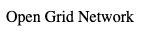
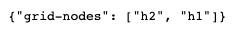
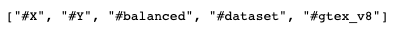

# Healthcare-Researcher-Connector (HRC) Package:
#### A Federated Learning repository for simulating `decentralized training` for common biomedical use-cases
[](https://travis-ci.org/vermasrijan/srijan-gsoc-2020)

[](https://github.com/dwyl/esta/issues)
[](https://github.com/Naereen/StrapDown.js/blob/master/LICENSE)
### Mentors : [Anton Kulaga](https://www.linkedin.com/in/antonkulaga/?originalSubdomain=ro), [Ivan Shcheklein](https://www.linkedin.com/in/shcheklein/), [Dmitry Petrov](https://www.linkedin.com/in/dmitryleopetrov/), [Vladyslava Tyshchenko](https://www.linkedin.com/in/vladyslava-tyshchenko-296742125/?originalSubdomain=ua), [Dmitry Nowicki]()<br/><br/>


## Table of Contents
- [About](#about)
    - [Intent](#intent)
- [Installation and Initialization](#installation-and-initialization)
- [Local Execution](#local-execution)
    - [Usage](#usage)
    - [Centralized Training](#centralized-training)
        - [DVC Centralized Stage](#dvc-centralized-stage)
    - [Decentralized Training](#decentralized-training)
        - [DVC Decentralized Stage](#dvc-decentralized-stage)
    - [Metrics](#metrics)
    - [Localhosts Example Screenshots](#localhosts-example-screenshots)
- [Remote Execution](#remote-execution)
    - [Server Side](#server-side)
    - [Client Side](#client-side)
- [Running DVC stages](#running-dvc-stages)
- [Notebooks](#notebooks)
- [Hyperparameter Optimization](#hyperparameter-optimization)
- [Testing](#testing)
- [Known Issues](#known-issues)
- [Tutorials / References](#tutorials--references)
- [GSoC Blog Post](#gsoc-blog-post)
- [Project Status](#project-status)
- [Acknowledgements](#acknowledgements)

## About
- Quality information exist as islands on gadgets like cell phones and PCs over the globe and are protected by severe security safeguarding laws. <br/>
- Federated Learning gives an astute methods for associating AI models to these incoherent information paying little heed to their areas, and all the more significantly, without penetrating protection laws.<br/>
- In biomedical research, sharing and use of human biomedical data is also heavily restricted and regulated by multiple laws. Such data-sharing restrictions allow keeping privacy of the patients but at the same time it impedes the pace of biomedical research, slows down the development of treatments of various diseases and often costs human lives.<br/>
- COVID-19 pandemic is unfortunately a good illustration of how inaccessibility of clinical training data leads to casualties that can be otherwise avoided.<br/>
- This repository is devoted to addressing this issue for the most common biomedical use-cases, like gene expression data.

### Intent
- It is an introductory project for simulating `easy-to-deploy` Federated Learning, for decentralized biomedical datasets.
    - A user can either simulate FL training locally (using `localhost`), or remotely (on `several machines`). 
    - A user can also compare centralized vs decentralized train metrics.
- Technology Stack used: 
    - [OpenMined](https://www.openmined.org/): [PySyft](https://github.com/OpenMined/PySyft), [PyGrid](https://github.com/OpenMined/PyGrid)
    - [DVC](https://dvc.org/)
    - [PyTorch](https://pytorch.org/)
    - [Docker](https://www.docker.com/)
- Example Dataset used:
    - [GTEx](https://gtexportal.org/home/): The Common Fund's Genotype-Tissue Expression (GTEx) Program established a data resource and tissue bank to study the relationship between genetic variants (inherited changes in DNA sequence) and gene expression (how genes are turned on and off) in multiple human tissues and across individuals.

## Installation and Initialization
> - NOTE: All the testing has been done on a MacOS / Linux based system
- Step 1: Install Docker & Docker-Compose, and pull required images from DockerHub
    1. To install `Docker`, just follow the [docker documentation](https://docs.docker.com/get-docker/).
    2. To install `Docker-Compose`, just follow the [docker-compose documentation](https://docs.docker.com/compose/install/).
    3. Start your `docker daemon`
    4. Pull grid-node image : `docker pull srijanverma44/grid-node:v028`
    5. Pull grid-network image : `docker pull srijanverma44/grid-network:v028`
    > Size of grid-node ~= 2GB, and that of grid-network ~= 300MB. That is, image sizes are large!
- Step 2: Install dependencies via conda
    1. Install Miniconda, for your operating system, from [https://conda.io/miniconda.html](https://conda.io/miniconda.html)
    2. `git clone https://github.com/vermasrijan/srijan-gsoc-2020.git`
    3. `cd srijan-gsoc-2020`
    4. `conda env create -f environment.yml`
    5. `conda activate pysyft_v028` (or `source activate pysyft_v028` for older versions of conda)
- Step 3: Install [GTEx](https://gtexportal.org/home/) `V8` Dataset
    - Pull `samples` and `expressions` data:  
```
dvc pull data/gtex/v8_samples.parquet.dvc -v
```
```
dvc pull data/gtex/v8_expressions.parquet.dvc -v
```
> - The above two commands will download GTEx data inside `data/gtex` directory, from Google Drive remote repository.
> - Initially, may be prompted to enter a verification code. For that, go to the URL which may be displayed on your CLI, copy the code, paste it at CLI and press Enter. (For more info, refer [1](https://dvc.org/doc/command-reference/pull) & [2](https://dvc.org/doc/user-guide/setup-google-drive-remote))
 
## Local execution
### Usage
- `src/initializer.py` is a python script for initializing either a centralized training, or a decentralized one.
- This script will create a compose yaml file, initialize `client/network` containers, execute FL/centralized training and will finally stop running containers (for network/nodes).
1. Make sure your `docker daemon` is running
2. Run the following command - 
    - `python src/initializer.py`
```     
Usage: initializer.py [OPTIONS]

Options:
  --samples_path TEXT       Input path for samples
  --expressions_path TEXT   Input for expressions
  --train_type TEXT         Either centralized or decentralized fashion
  --dataset_size INTEGER    Size of data for training
  --split_type TEXT         balanced / unbalanced / iid / non_iid
  --split_size FLOAT        Train / Test Split
  --n_epochs INTEGER        No. of Epochs / Rounds
  --metrics_path TEXT       Path to save metrics
  --model_save_path TEXT    Path to save trained models
  --metrics_file_name TEXT  Custom name for metrics file
  --no_of_clients INTEGER   Clients / Nodes for decentralized training
  --swarm TEXT              Option for switching between docker compose vs docker stack
  --tags TEXT               Give tags for the data, which is to be sent to the nodes
  --node_start_port TEXT    Start port No. for a node
  --grid_address TEXT       grid address for network
  --grid_port TEXT          grid port for network
  --help                    Show this message and exit.
```

### Centralized Training
- Example command:
```
python src/initializer.py --train_type centralized --dataset_size 17000 --n_epochs 50        
```
- `Centralized training` example output, using **50 epochs**:
``` 
============================================================
----<DATA PREPROCESSING STARTED..>----
----<STARTED TRAINING IN A centralized FASHION..>----
DATASET SIZE: 17000
Epoch: 0 Training loss: 0.00010540  | Training Accuracy: 0.1666
Epoch: 1 Training loss: 0.00010540  | Training Accuracy: 0.1669
.
.
Epoch: 48 Training loss: 9.3619e-05  | Training Accuracy: 0.4356
Epoch: 49 Training loss: 9.3567e-05  | Training Accuracy: 0.4359
---<SAVING METRICS.....>----
============================================================
OVERALL RUNTIME: 43.217 seconds
```
#### DVC Centralized Stage
`dvc repro centralized_train`

### Decentralized Training
- Example command:
```
python src/initializer.py --train_type decentralized --dataset_size 17000 --n_epochs 50 --no_of_clients 2     
```
- `Decentralized training` example output, using **50 epochs**:
> - Distributed information, like total no. of samples with each client, will be displayed first.
```
============================================================
----<DATA PREPROCESSING STARTED..>----
----<STARTED TRAINING IN A decentralized FASHION..>----
DATASET SIZE: 17000
TOTAL CLIENTS: 2
DATAPOINTS WITH EACH CLIENT:
client_h1: 8499 ; Label Count: {0: 1445, 1: 1438, 2: 1429, 3: 1432, 4: 1394, 5: 1361}
client_h2: 8499 ; Label Count: {0: 1388, 1: 1395, 2: 1404, 3: 1401, 4: 1439, 5: 1472}
---<STARTING DOCKER IMAGE>----
====DOCKER STARTED!=======
Go to the following addresses: ['http://0.0.0.0:5000', 'http://0.0.0.0:5000/connected-nodes', 'http://0.0.0.0:5000/search-available-tags', 'http://0.0.0.0:3000', 'http://0.0.0.0:3001']
Press Enter to continue...
WORKERS:  ['h1', 'h2']
Train Epoch: 0 | With h2 data |: [8499/16998 (50%)]	    Train Loss: 0.000211 | Train Acc: 0.164
Train Epoch: 0 | With h1 data |: [16998/16998 (100%)]	Train Loss: 0.000211 | Train Acc: 0.192
Train Epoch: 1 | With h2 data |: [8499/16998 (50%)]	    Train Loss: 0.000211 | Train Acc: 0.172
Train Epoch: 1 | With h1 data |: [16998/16998 (100%)]	Train Loss: 0.000211 | Train Acc: 0.229
.
.
Train Epoch: 49 | With h2 data |: [8499/16998 (50%)]	Train Loss: 0.000187 | Train Acc: 0.384
Train Epoch: 49 | With h1 data |: [16998/16998 (100%)]	Train Loss: 0.000187 | Train Acc: 0.389
---<STOPPING DOCKER NODE/NETWORK CONTAINERS>----
381c4f79fb5c
c203c2f6fd62
1d3ccce7f732
---<SAVING METRICS.....>----
============================================================
OVERALL RUNTIME: 380.418 seconds
```

#### DVC Decentralized Stage
`dvc repro decentralized_train`

### Metrics
- NOTE: By default, metrics will be saved in `data/metrics` directory. 
- You can pass in the `--metrics_path <path>` flag to change the default directory.

### Localhosts Example Screenshots
1. Following is what you may see at http://0.0.0.0:5000
    - 
2. Following is what you may see at http://0.0.0.0:5000/connected-nodes
    - 
3. Following is what you may see at http://0.0.0.0:5000/search-available-tags
    - 
4. Following is what you may see at http://0.0.0.0:3000
    - 

## Remote Execution
> - Make sure all Firewalls are disabled on both, client and server side.
> - Docker-compose will be required in this section.
### Server Side
- `docker-compose -f gridnetwork-compose.yml up`

### Client Side
- STEP 1: Configure the environment variable called `NETWORK`, and replace it with <SERVER_IP_ADDRESS>
- STEP 2: `docker-compose -f gridnode-compose.yml up`. You can edit this compose file to add more clients, if you'd like.

> - NOTE: Remote execution has not yet been tested properly.

## Running DVC stages
- DVC stages are in `dvc.yaml` file, to run dvc stage just use `dvc repro <stage_name>`

## Notebooks
> - Notebooks, given in this repository, simulate decentralized training using 2 clients. 
> - Docker-compose will be required in this section as well!
- STEP 1: `docker-compose -f notebook-docker-compose.yml up`
- STEP 2: `conda activate pysyft_v028` (or `source activate pysyft_v028` for older versions of conda)
- STEP 3: Go to the following addresses: 
```
['http://0.0.0.0:5000', 'http://0.0.0.0:5000/connected-nodes', 'http://0.0.0.0:5000/search-available-tags', 'http://0.0.0.0:3000', 'http://0.0.0.0:3001']
```
- STEP 4: Initialize `jupyter lab`
- STEP 5: Run data owner notebook: `notebooks/data-owner_GTEx.ipynb`
- STEP 6: Run model owner notebook: `notebooks/model-owner_GTEx.ipynb`
- STEP 7: STOP Node/Network running containers:
```
docker rm $(docker stop $(docker ps -a -q --filter ancestor=srijanverma44/grid-network:v028 --format="{{.ID}}"))
```
```
docker rm $(docker stop $(docker ps -a -q --filter ancestor=srijanverma44/grid-node:v028 --format="{{.ID}}"))
```
> __NOTE__: 
> - Notebooks given in this repository have been taken from this [branch](https://github.com/OpenMined/PySyft/tree/master/examples/tutorials) and have been modified.

## Hyperparameter Optimization
```
python src/tune.py --help
```
> - In Progress...

## Testing
- Test Centralized training:
```
dvc repro centralized_test
```
- Test Decentralized training:
```
dvc repro decentralized_test
```

## Known Issues
1. While creating an environment:                                                                                                                                                                                                                                                                                                                                                                                                                           
    - While creating an env. on a linux machine, you may get the following error: `No space left on device`. (refer [here](https://stackoverflow.com/questions/40755610/ioerror-errno-28-no-space-left-on-device-while-installing-tensorflow))                                                                                                                                                                                                                                                                                                                                                                                                         
    - Solution: 
    - `export TMPDIR=$HOME/tmp` (i.e. change /tmp directory location)
    - `mkdir -p $TMPDIR`
    - `source ~/.bashrc` , and then run the following command -
    - `conda env create -f environment.yml`
2. While training:
    - Some errors while training in a decentralized way:
    - `ImportError: sys.meta_path is None, Python is likely shutting down`
    - Solution - NOT YET RESOLVED!
3. Notebooks:
    - Data `transmission rate` (i.e, sending large-sized tensors to the nodes) may be slow. (refer [this](https://github.com/OpenMined/PySyft/issues/3539))

## Tutorials / References
1. [OpenMined Welcome Page, high level organization and projects](https://github.com/OpenMined/OM-Welcome-Package)
2. [OpenMined full stack, well explained](https://www.youtube.com/watch?v=NJBBE_SN90A)<br/>
3. [Understanding PyGrid and the use of dynamic FL](https://github.com/OpenMined/Roadmap/blob/master/web_and_mobile_team/projects/dynamic_federated_learning.md)<br/>
4. [PyGrid reorganization RoadMap](https://github.com/OpenMined/Roadmap/blob/master/web_and_mobile_team/projects/common/pygrid_reorganization.md)<br/>
5. [OpenMined FL roadmap and other terminologies](https://github.com/OpenMined/Roadmap/blob/master/web_and_mobile_team/projects/federated_learning.md)
6. [What is PyGrid demo](https://blog.openmined.org/what-is-pygrid-demo/)

## GSoC Blog Post
- [GSoC Journey 2020](https://medium.com/@verma.srijan/gsoc-journey-2020-12e806fc80c3)

## Project Status
**Under Development:** Please note that the project is in its early development stage and all the features have not been tested yet.

## Acknowledgements
1. I would like to thank all my mentors for taking the time to mentor me and for their invaluable suggestions throughout. I truly appreciate their constant trust and encouragement!<br/>

2. [Open Bioinformatics Foundation](https://www.open-bio.org/) admins, helpdesk and the whole community <br/>

3. [OpenMined Community](https://www.openmined.org/), for their constant help throughout!

4. [Systems Biology of Aging Group](http://www.aging-research.group/) <br/>

5. [Iterative.ai](https://iterative.ai/) and [DVC](https://dvc.org/) <br/>

6. [GSoC](https://summerofcode.withgoogle.com/) organizers, managers and Google 